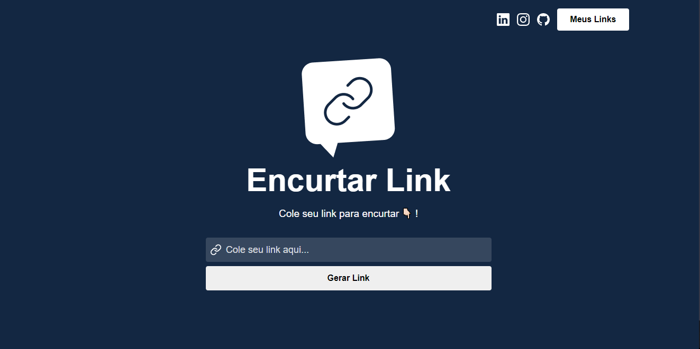
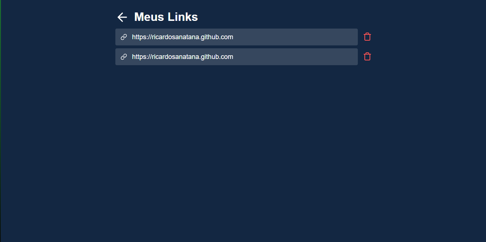

<h1 align="center">Encurtador De Link</h1>
<h2 align="center">Encurtador de link, projeto para dar continuidade aos estudos com ReactJS seus conceitos de variáveis de estados/Hooks, componentização e responsividade.</h2>

 
 

    <h3>Tecnologias utilizadas: 
    
    
    
    </h3>

 
 

    <h1 align="center">Tela da Home Page</h1>  
        
    <h1 align="center">Tela dos Meus Linkss</h1> 
    

##
 
 

  <h1>Em fase de desenvolvimento</h1>

  
